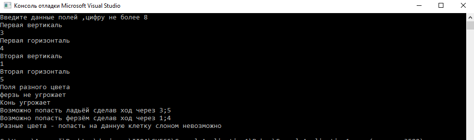
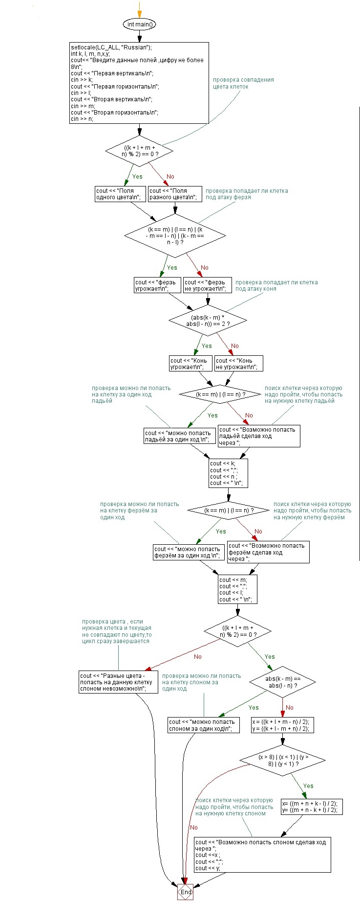

# CHESS
Шахматы -
это программа создана для операций с шахматной доской , такими как :Сравнение цветов клеток ,Попадает ли фигура под удар Ферзя/Коня , Сможет ли фигура с первого раза попасть на заданную нами (В случае со слоном сможет ли вообще) клетку шахматной доски ,если со второго раза ,то с какого места был завершен первый ход .
Для усаешного запуска программы необходимо ввести 4 числа не более 8 , снача идет запись координат первой клетки ,а после второй клетки на шахматной доске.

(Скриншот работы программы)

к работе прилагается блок-схема программы

